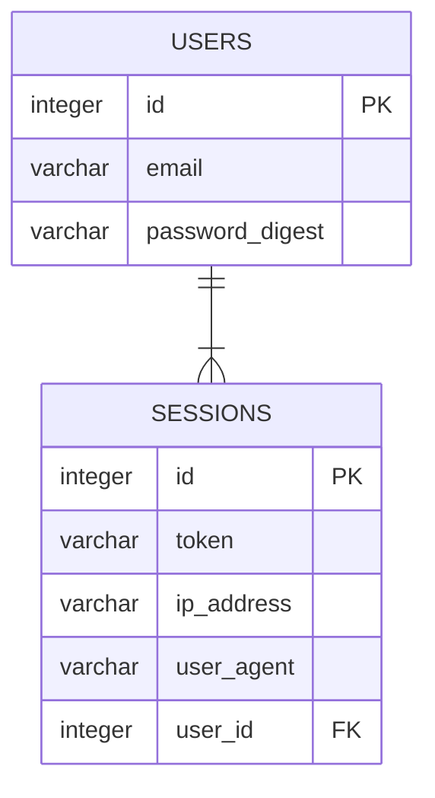

# Backend Evaluation S2/2025 - Park42

**Park42** is a car parking reservation service, similar to those used for booking airport parking spots in advance.

This monorepo contains the **Park42** API and a supporting mock payment service used during development.

## Requirements

- Node.js 22
- [Docker](https://docs.docker.com/get-docker/) and [Docker Compose](https://docs.docker.com/compose/install/)

## Important Dependencies

- [Fastify](https://github.com/fastify/fastify)
- [Knex](https://github.com/knex/knex)
- [Objection](https://github.com/Vincit/objection.js)
- [BullMQ](https://github.com/taskforcesh/bullmq)

## Setting Up

- `bin/install` – Install dependencies
- `docker-compose up --build` – Start PostgreSQL, Redis and the mock payment API
- `bin/npm run dev:db:create` – Create the database
- `bin/npm run dev:db:migrate` – Migrate the database
- `bin/npm run dev:db:seed` – Seed the database

## Running

Use the wrapper scripts at the repository root to work with the application.
During development the database and auxiliary services run inside Docker, while the application runs on the host.

- `docker-compose up` – Ensure the services are running
- `bin/npm run dev:worker` – Start the BullMQ worker
- `bin/dev` – Start the application with automatic reloading

## Running Tests

- `bin/npm run test:db:create` – Create the test database
- `bin/npm run test:db:migrate` – Migrate the test database
- `bin/npm run test` – Run the test suite

## Description

The application is currently in its early stages and consists of a minimal set of entities and endpoints.

Users create `Sessions` to obtain a token and can request price calculations through the `/prices` endpoint.

## Entities

> [!NOTE]
> Some standard fields have been omitted from the diagram for brevity.
